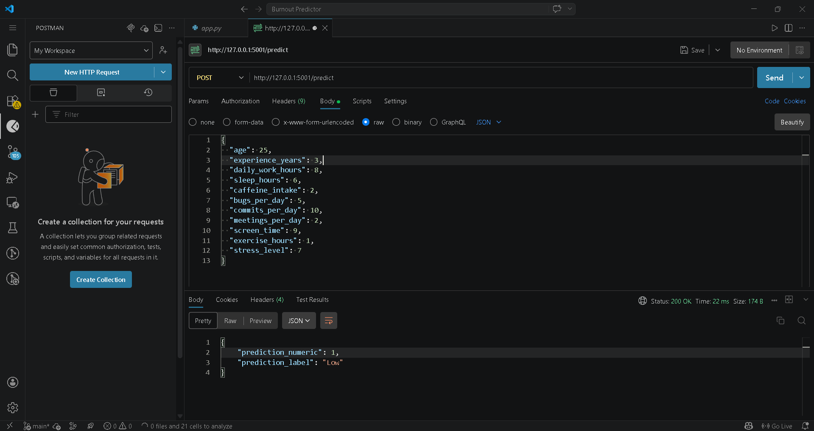

# ***Burnout Predictor***
Machine Learning-based Burnout Prediction system that analyzes work and lifestyle features to classify burnout levels (Low, Medium, High) using a trained model and FastAPI for API access.

---

# ⚡ Short Version
Burnout prediction using Machine Learning with FastAPI-based REST API.

---

# 💡 Technical Version
End-to-end burnout prediction project using Machine Learning, including data preprocessing, model training, evaluation, and deployment with FastAPI for real-time predictions.

---

# 🎯 With Features
Burnout Prediction system built with Machine Learning that:
* Processes behavioral and work-related data
* Trains classification models
* Provides predictions via FastAPI REST API

---

# 📸 Application Preview

 
  

